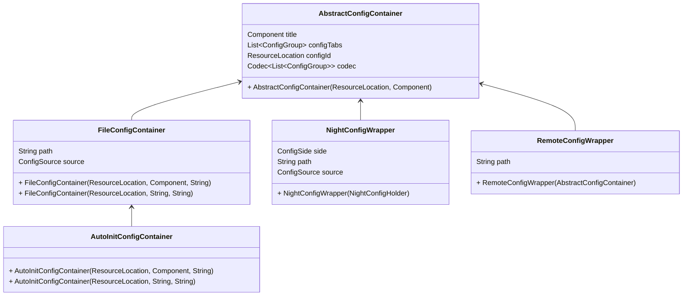

# Concepts

## Config Container

Config containers are abstract implementations for all configs. The basic class is `AbstractConfigContainer` and all config containers are its subclass.

For developers, there are 2 containers you need to use:
- `FileConfigContainer`: Indicate a config which should save to disk.
- `AutoInitConfigContainer`: An extended version of `FileConfigContainer`, which will use reflect to automatically register config entries.

Config containers can also used to wrap other configs:
- `RemoteConfigWrapper`: This is used for editing a server config when you join a dedicated server. The main difference is that it will send values to server when saving.
- `NightConfigWrapper`: Used to support night config data from (Neo)Forge config system and `Forge Config API Port`.

## Config Entry

A config entry save a key-value pair of a single value. All entries are implementations of `BaseEntry` class. (Except `SeparatorEntry`)

Due to many optional fields in a config entry, all entries are created with `Builder`, you cau use `builder()` method to get one.

## Config Type

Each config entry has a unique config type. This is used for config value type recognition and rendering.

## Config Source

Indicate where the config is come from. By default you don't need to take care of this.