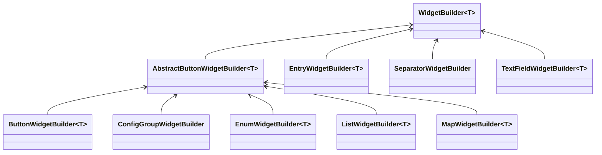

# Creating a New Entry Type

There are 3 things needed to create a new entry type:
- Config Type
- Entry Class
- Widget Builder

## Config Type

You can refer to builtin types:

```java reference
https://github.com/IAFEnvoy/Jupiter/blob/main/src/main/java/com/iafenvoy/jupiter/config/type/ConfigTypes.java
```

## Entry Class

To make entry class for your own object type, create a new class and extends `BaseEntry<T>`.

```java
public class BooleanEntry extends BaseEntry<Boolean> {
    protected BooleanEntry(Builder builder) {
        super(builder);
    }

    @Override
    public ConfigType<Boolean> getType() {
        return //Config type you create above.
    }

    @Override
    public IConfigEntry<Boolean> newInstance() {
        return new Builder(this).build();
    }

    @Override
    public Codec<Boolean> getCodec() {
        return Codec.BOOL;
    }
}
```

Since there are many optional fields, using a builder is a good way to create entries.

```java
public class BooleanEntry extends BaseEntry<Boolean> {
    //BaseEntry implementation code...

    public static Builder builder(Component name, boolean defaultValue) {
        return new Builder(name, defaultValue);
    }

    public static Builder builder(String nameKey, boolean defaultValue) {
        return new Builder(nameKey, defaultValue);
    }

    public static class Builder extends BaseEntry.Builder<Boolean, BooleanEntry, Builder> {
        public Builder(Component name, boolean defaultValue) {
            super(name, defaultValue);
        }

        public Builder(String nameKey, boolean defaultValue) {
            super(nameKey, defaultValue);
        }

        public Builder(BooleanEntry parent) {
            super(parent);
        }

        @Override
        public Builder self() {
            return this;
        }

        @Override
        protected BooleanEntry buildInternal() {
            return new BooleanEntry(this);
        }
    }
}
```

## Widget Builder

This will control how entry display in config screen.

:::warning

Widget builders are only available on client side.

:::

There are some builtin widget builder you can use:



:::warning

`TextFieldWidgetBuilder` can only be used when your entry implemented [`TextFieldConfigEntry`](#textfieldconfigentry)

:::

For custom widget builder, create a class extends `WidgetBuilder<T>`.

```java reference title="Example"
https://github.com/IAFEnvoy/Jupiter/blob/main/src/main/java/com/iafenvoy/jupiter/render/widget/builder/ButtonWidgetBuilder.java
```

## `TextFieldConfigEntry`

`TextFieldConfigEntry` is a special interface for numeric values. You need to implement in your entry if you want to use `TextFieldWidgetBuilder`.